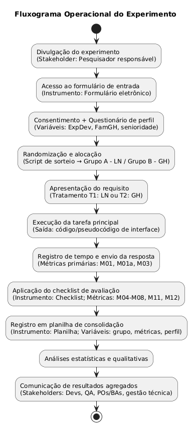

# 1. Identificação básica

## 1.1 Título do experimento

**Notação Gherkin vs. Linguagem Natural: Impactos na Acurácia e Retrabalho em Critérios de Aceite**

## 1.2 ID / código

**GHLN-02**

## 1.3 Versão do documento e histórico de revisão

**Versão atual:** v3.0  

**Histórico de revisão:**

- v1.0 (21/11/2025): rascunho inicial com tema, escopo e motivação.
- v2.0 (24/11/2025): entrega 2 + revisão da seção 2.
- v3.0 (26/11/2025): seções 7, 8, 9, 10, 11 e 12.

## 1.4 Datas (criação, última atualização)

- **Data de criação:** 21/11/2025  
- **Última atualização:** 26/11/2025

## 1.5 Autores (nome, área, contato)

- **Sophia Mendes Rabelo** — Engenharia de Software — contato: **sophiamendesrabelo@gmail.com**

## 1.6 Responsável principal (PI / dono do experimento)

- **Sophia Mendes Rabelo**

## 1.7 Projeto / produto / iniciativa relacionada

Atividade acadêmica de Experimentação em Engenharia de Requisitos / Processos Ágeis.

O experimento está ligado ao estudo de técnicas de escrita de critérios de aceite e seus impactos na implementação.

---

# 2. Contexto e problema

## 2.1 Descrição do problema / oportunidade

No ciclo de vida de desenvolvimento de software, a falha na engenharia de requisitos permanece como uma das principais causas de defeitos (bugs) e retrabalho. O problema torna-se crítico em interfaces de usuário (Front-end) de alta complexidade interativa, onde regras de validação dinâmica, gerenciamento de estados de componentes e feedbacks visuais precisam ser comunicados com precisão absoluta.

Atualmente, a indústria enfrenta um dilema na especificação desses critérios:

- **Linguagem Natural:** permite detalhamento narrativo e contexto da experiência do usuário, mas sofre com ambiguidade sobre *triggers* de eventos e condições de exibição.
- **Notação Gherkin (BDD):** busca remover a ambiguidade através de uma estrutura rígida (Dado/Quando/Então), mas impõe a fragmentação do comportamento da interface em múltiplos cenários desconectados.

A oportunidade deste estudo reside em investigar se, ao fragmentar regras de interface para atender ao formalismo do Gherkin, não se está introduzindo um “ponto cego” cognitivo: a perda de contexto sobre o ciclo de vida do componente, levando a erros de omissão. O objetivo é determinar empiricamente qual formato oferece maior segurança para a corretude do comportamento visual e menor retrabalho na implementação de lógica de interface.

## 2.2 Contexto organizacional e técnico

O experimento será conduzido como um estudo controlado em ambiente acadêmico/simulado.

- **Cenário:** simulação de uma etapa de implementação de front-end de uma funcionalidade crítica.
- **Participantes:** o grupo amostral será composto por desenvolvedores front-end e QA, divididos aleatoriamente em dois grupos de tratamento.
- **Objeto de estudo:** serão utilizados critérios de aceite de um componente rico de interface, desenhados especificamente para conter desafios de gerenciamento de estado e validação condicional.
- **Instrumentação:** a coleta de dados será realizada via formulários eletrônicos onde os participantes deverão escrever a lógica de controle do componente (pseudocódigo ou script). O foco não é a estilização, mas sim a lógica de eventos, manipulação de estados e a densidade de bugs funcionais de interface inseridos.

## 2.3 Trabalhos e evidências prévias (internos e externos)

A fundamentação deste experimento combina teorias clássicas com evidências recentes do cenário ágil e de automação:

- **Persistência do problema em ágil:** dados recentes do *17th State of Agile Report* (2024) indicam que “requisitos pouco claros” continuam entre as principais causas de falha em projetos, refutando a ideia de que processos ágeis eliminaram o problema da especificação. Estudos de Mendes & Silva (2023) corroboram que a ambiguidade gera um volume significativo de *rework churn* (taxa de retrabalho) mesmo em ciclos curtos.
- **Ambiguidade em user stories:** pesquisas recentes sobre Processamento de Linguagem Natural (PLN), como as de Dalpiaz et al. (2021), apontam que user stories escritas puramente em linguagem natural apresentam “ambiguidade nociva” em cerca de 45% dos casos industriais, validando a necessidade de formalismos.
- **O “gap” humano na literatura de BDD:** revisões sistemáticas recentes, como Zampetti et al. (2021) e Rahman (2023), demonstram que a pesquisa acadêmica sobre Gherkin está massivamente focada na geração automática de testes (muitas vezes via IA). Existe uma escassez crítica de estudos experimentais atuais que avaliem a leiturabilidade cognitiva da notação para o ser humano. Este trabalho preenche essa lacuna ao questionar se o desenvolvedor consegue compreender regras complexas “escondidas” atrás da estrutura rígida do Gherkin.

## 2.4 Referencial teórico e empírico essencial

- **Behavior Driven Development (BDD):** metodologia que utiliza a notação estruturada Gherkin para descrever comportamentos. O estudo foca no Gherkin como ferramenta de documentação para humanos, não apenas para máquinas.
- **Taxonomia de erros (métricas):**
  - **Erros de comissão (precisão):** o desenvolvedor implementa algo errado por má interpretação de valores ou operadores (hipótese: maior incidência na linguagem natural).
  - **Erros de omissão (contexto):** o desenvolvedor deixa de implementar uma regra ou exceção por não visualizá-la na fragmentação dos cenários (hipótese: maior incidência no Gherkin em cenários complexos).

---

# 3. Objetivos e questões (Goal / Question / Metric)

## 3.1 Objetivo geral (goal template)

Analisar a notação Gherkin e a linguagem natural com o propósito de **avaliação** em relação ao tempo de desenvolvimento, à densidade de bugs de estado/validação, à corretude do comportamento e ao esforço de retrabalho, sob o ponto de vista de desenvolvedores de software, no contexto de uma tarefa simulada de codificação de um componente rico de interface com regras complexas.

## 3.2 Objetivos específicos

- **O1 (eficiência):** comparar o tempo médio gasto para traduzir o requisito (Gherkin vs. texto) em lógica de controle de interface funcional.
- **O2 (corretude de estados):** avaliar qual formato resulta em implementações mais fiéis ao ciclo de vida do componente (por exemplo, loading, sucesso, erro).
- **O3 (robustez/bugs):** identificar qual formato induz a maior inserção de bugs em validações condicionais e tratamentos de exceção de interface.
- **O4 (retrabalho):** mensurar a necessidade de correções posteriores baseada na qualidade da primeira entrega do código, com foco no esforço de retrabalho.

## 3.3 Questões de pesquisa / de negócio

**Relacionadas ao O1 (tempo/eficiência)**

- **Q1.1:** desenvolvedores levam menos tempo para estruturar a lógica do componente quando guiados por passos estruturados (Gherkin)?
- **Q1.2:** a leitura de texto corrido (linguagem natural) atrasa o início da codificação devido à necessidade de extrair as regras de interação?
- **Q1.3:** existe diferença na produtividade entre os grupos?

**Relacionadas ao O2 (corretude de estados)**

- **Q2.1:** qual grupo implementou o fluxo principal com maior taxa de sucesso?
- **Q2.2:** a estrutura do Gherkin garante que todas as transições de estado sejam codificadas corretamente?
- **Q2.3:** existe diferença significativa na implementação de estados de exceção entre os grupos?

**Relacionadas ao O3 (bugs e exceções)**

- **Q3.1:** qual formato gerou mais bugs de omissão?
- **Q3.2:** qual formato gerou mais bugs de lógica de fluxo?
- **Q3.3:** há diferença significativa entre os formatos na taxa de falhas de validação de entrada em *edge cases*?

**Relacionadas ao O4 (retrabalho)**

- **Q4.1:** quantas submissões de código seriam reprovadas em um code review por falharem em critérios de usabilidade ou validação?
- **Q4.2:** existe diferença significativa no esforço estimado (tempo) para corrigir os bugs gerados por cada formato?
- **Q4.3:** os defeitos encontrados tendem a ser de qual severidade dependendo do formato utilizado?

## 3.4 Métricas associadas (GQM)

### 3.4.1 Mapeamento Objetivo–Questão–Métrica

| Objetivo        | Questão  | Métricas (IDs) | O que se espera medir                                                                                  |
|----------------|----------|----------------|---------------------------------------------------------------------------------------------------------|
| O1. Eficiência | Q1.1     | M01, M02       | Tempo total e variação para implementar a lógica a partir do requisito.                                |
| O1. Eficiência | Q1.2     | M01a           | Tempo até iniciar a codificação e efeito do formato na largada.                                        |
| O1. Eficiência | Q1.3     | M03            | Produtividade: regras corretas por minuto.                                                             |
| O2. Corretude  | Q2.1     | M04            | Sucesso no fluxo principal (“caminho feliz”).                                                          |
| O2. Corretude  | Q2.2     | M05            | Cobertura das transições/estados descritos no requisito.                                               |
| O2. Corretude  | Q2.3     | M05, M06, M07  | Implementação correta de estados de exceção; omissões e erros de lógica.                              |
| O3. Bugs       | Q3.1     | M06, M08       | Omissões de regras de interface e sua densidade relativa.                                              |
| O3. Bugs       | Q3.2     | M07, M08       | Erros de lógica de fluxo e sua densidade relativa.                                                     |
| O3. Bugs       | Q3.3     | M11            | Falhas em validações de entrada em casos de borda.                                                     |
| O4. Retrabalho | Q4.1     | M09, M10       | Taxa de reprovação em code review e esforço associado para correção.                                   |
| O4. Retrabalho | Q4.2     | M10            | Esforço de retrabalho estimado (tempo) para corrigir os bugs gerados.                                  |
| O4. Retrabalho | Q4.3     | M12            | Severidade predominante dos defeitos por formato.                                                      |

### 3.4.2 Definição das métricas

| ID   | Nome da métrica              | Descrição da métrica                                                                                          | Unidade                |
|------|------------------------------|----------------------------------------------------------------------------------------------------------------|------------------------|
| M01  | Tempo de implementação       | Tempo total gasto pelo desenvolvedor para ler o requisito e escrever a lógica do componente.                  | Minutos/segundos       |
| M01a | Tempo de start-up            | Tempo desde a abertura do requisito até a primeira linha de código.                                           | Minutos/segundos       |
| M02  | Desvio padrão do tempo       | Variação do tempo dentro do mesmo grupo.                                                                      | Minutos                |
| M03  | Code velocity (interface)    | Razão entre o número de regras de interface atendidas corretamente e o tempo gasto (M01).                     | Regras/minuto          |
| M04  | Acurácia do caminho feliz    | Indicador binário de que o fluxo principal de interação funciona corretamente.                                | Binária (0 ou 1)       |
| M05  | Cobertura de estados         | Percentual de estados de interface descritos que foram tratados no código.                                    | Porcentagem (%)        |
| M06  | Bugs de omissão              | Contagem de comportamentos de interface exigidos que não foram implementados.                                 | Contagem absoluta      |
| M07  | Bugs de lógica de fluxo      | Contagem de erros em condicionais de validação ou transições de estado incorretas.                            | Contagem absoluta      |
| M08  | Densidade de defeitos        | (M06 + M07) dividido pelo número de regras/transições previstas no checklist de referência.                   | Bugs/regra prevista    |
| M09  | Taxa de rejeição (simulada)  | Classificação do código como "aprovado" ou "requer ajustes" funcionalmente.                                  | Binária (pass/fail)    |
| M10  | Esforço de retrabalho estimado | Estimativa de tempo para corrigir os bugs encontrados.                                                       | Minutos (estimado)     |
| M11  | Falhas em casos de borda     | Contagem de falhas especificamente em validações de entrada e casos de borda; recorte temático de M06/M07.   | Contagem absoluta      |
| M12  | Classificação de severidade  | Categorização do impacto do bug em níveis (baixo, médio, alto, bloqueante), tratada como escala ordinal.     | Categórica (ordinal)   |

---

# 4. Escopo e contexto do experimento

## 4.1 Escopo funcional / de processo (incluído e excluído)

**Incluído (escopo do experimento):**

- **Lógica de interação do usuário:** interpretação de regras sobre eventos de interface (clique, foco, digitação, hover).
- **Gestão de estados visuais (state management):** definição de regras para alternância de estados dos componentes (habilitado/desabilitado, carregando, visível/oculto, sucesso/erro).
- **Lógica de validação no cliente:** implementação de regras de feedback imediato ao usuário (mensagens de erro, cores de validação) baseadas nos critérios de aceite.
- **Pseudocódigo de componentes:** escrita da lógica funcional (por exemplo, funções JavaScript/TypeScript ou manipuladores de eventos) que controlam o comportamento da tela.

**Excluído (fora do escopo):**

- **Estilização visual (CSS/styles):** não será avaliada a fidelidade de cores, fontes, espaçamentos ou layout responsivo (pixel-perfect).
- **Estrutura semântica (HTML):** a hierarquia de tags não é objeto de avaliação, apenas a lógica atrelada a elas.
- **Integração com backend:** não será exigida a implementação real de chamadas de API (fetch/axios), apenas a simulação do tratamento de suas respostas (sucesso/falha).

## 4.2 Contexto do estudo (tipo de organização, projeto, experiência)

O estudo caracteriza-se como um experimento controlado simulando o desenvolvimento de front-end em um ambiente corporativo moderno.

- **Tipo de organização:** acadêmica/simulada.
- **Cenário do projeto:** implementação de um componente de interface crítico em uma aplicação web (por exemplo, checkout ou formulário de registro complexo), onde a experiência do usuário depende estritamente do cumprimento das regras de comportamento.
- **Perfil dos participantes:** amostragem composta por indivíduos com conhecimentos em desenvolvimento web (front-end ou fullstack) e garantia de qualidade.
- **Criticidade:** o cenário foca em “usabilidade crítica”, onde falhas na lógica de interface (por exemplo, botão habilitado na hora errada) podem bloquear o usuário ou induzi-lo ao erro.

## 4.3 Premissas

Para a validade do experimento, assume-se que:

- Os participantes compreendem o conceito de “estados de interface” (loading, disabled, error etc.).
- A complexidade do cenário está na interatividade.
- O tempo reportado inclui a leitura da regra e a escrita da lógica do script, ignorando o tempo de estilização.

## 4.4 Restrições

O desenho experimental respeita as seguintes limitações práticas:

- **Abstração visual:** como o experimento é via formulário de texto, não é possível validar o “look and feel” visualmente. A validação será feita sobre a descrição lógica do comportamento.
- **Independência de framework:** o participante poderá escrever a solução pensando em React, Vue, Angular etc., desde que a lógica de controle de estado esteja clara.
- **Tempo de execução:** atividade limitada a 20–30 minutos para evitar fadiga cognitiva.

## 4.5 Limitações previstas

Fatores que podem ameaçar a validade externa:

- **Subjetividade de UX:** diferente do backend, regras de interface em linguagem natural podem ser interpretadas de formas variadas dependendo da bagagem de UX do desenvolvedor, o que pode ser confundido com erro de interpretação.
- **Falta de protótipo visual:** a ausência de um layout (por exemplo, Figma) junto com o requisito textual pode aumentar a dificuldade artificialmente, já que no mundo real o front-end quase sempre trabalha com requisitos + design visual.

---

# 5. Stakeholders, interesses e impactos

## 5.1 Stakeholders principais

- **Pesquisador responsável:** conduz o experimento, garante rigor metodológico e analisa os dados.
- **Desenvolvedores (front-end/fullstack):** público-alvo central; consomem os requisitos e são diretamente afetados por ambiguidade e carga cognitiva.
- **Product owners (POs) / business analysts (BAs):** autores dos critérios de aceite; interessados em reduzir ruídos de comunicação com o time técnico.
- **Lideranças técnicas (tech leads / engineering managers):** interessadas em reduzir lead time e retrabalho decorrente de falhas de especificação.
- **Analistas de qualidade (QA):** interessados na consistência entre o que foi especificado, implementado e testado.

## 5.2 Interesses e expectativas dos stakeholders

- **Desenvolvedores:** identificar o formato que melhor equilibra rapidez de leitura e clareza das regras de interface, reduzindo inferências e “adivinhações”.
- **POs/BAs:** avaliar se o custo adicional de escrever em Gherkin se traduz em menos bugs; caso contrário, sustentar formatos híbridos ou mais leves.
- **Gestão técnica:** obter evidências para padronizar a escrita de user stories, aumentando eficiência do fluxo e reduzindo retrabalho.

## 5.3 Impactos potenciais no processo / produto

**Impacto no processo de refinamento:**

- Se o Gherkin reduzir bugs de estado/validação em cenários complexos, recomenda-se seu uso obrigatório nesses casos, mesmo com maior esforço inicial.
- Se a linguagem natural reduzir omissões por manter melhor contexto, recomenda-se seu uso como fonte primária de compreensão do desenvolvedor, deixando o Gherkin como apoio à automação de testes.

**Impacto na qualidade do produto (front-end):**

- Menos bugs de interface crítica: menor incidência de falhas de usabilidade.
- Menos retrabalho: redução de rejeições em code review e de retornos de QA para desenvolvimento.

---

# 6. Riscos de alto nível, premissas e critérios de sucesso

## 6.1 Riscos de alto nível (negócio, técnicos, etc.)

- **Baixa adesão (amostragem insuficiente):** risco de não atingir as 100 respostas válidas necessárias para conseguir realizar o cálculo estatístico planejado.
- **Heterogeneidade técnica:** risco de discrepância forte de senioridade distorcer tempo e qualidade.
- **Fadiga ou abandono (drop-out):** risco de o cenário ser longo/complexo, aumentando desistência.
- **Contaminação por IA generativa:** risco de uso de modelos de inteligência artificial para gerar solução, invalidando a medida de esforço cognitivo humano.
- **Viés de design:** risco de o erro ocorrer por preferência pessoal do participante, e não por leitura do requisito.

## 6.2 Critérios de sucesso globais (go / no-go)

**Tamanho da amostra (mínimo):**

- **GO:** obter 80 ou mais respostas válidas.
- **NO-GO:** obter menos de 60 respostas válidas.

**Qualidade dos dados:**

- **GO:** pelo menos 80% das submissões contêm código inteligível.
- **NO-GO:** menos de 70% das submissões contêm código inteligível.

**Balanceamento dos grupos:**

- **GO:** distribuição equilibrada entre Grupo A (linguagem natural) e Grupo B (Gherkin) em termos de senioridade e familiaridade com Gherkin.
- **NO-GO:** desequilíbrio relevante entre os grupos em senioridade ou familiaridade com Gherkin, indicando viés técnico.

## 6.3 Critérios de parada antecipada (pré-execução)

- **Falha no teste piloto:** se participantes do piloto reportarem cenário incompreensível ou levarem mais de 40 minutos, os requisitos devem ser reescritos.
- **Inviabilidade técnica da ferramenta:** se o formulário não suportar bem blocos de código, inviabilizando análise posterior.
- **Desvio crítico de interpretação:** se os primeiros cinco participantes errarem o “caminho feliz”, isso indica má formulação do enunciado e o requisito deve ser revisado antes de continuar a divulgação.

---

# 7. Modelo conceitual e hipóteses

## 7.1 Modelo conceitual do experimento

O formato dos critérios de aceite (Gherkin vs. linguagem natural) altera como o desenvolvedor lê, extrai e organiza regras de interface. Essa mudança afeta a carga cognitiva, a manutenção do contexto do ciclo de vida do componente e a chance de ambiguidade ou omissão, influenciando diretamente tempo, corretude de estados, bugs e, principalmente, o esforço de retrabalho necessário após a primeira entrega.

## 7.2 Hipóteses formais (H0, H1)

### Hipótese principal (retrabalho – variável dependente M10)

- **H0_principal:** o esforço médio de retrabalho (M10) é igual entre o grupo que utiliza linguagem natural (LN – A) e o grupo que utiliza Gherkin (GH – B).
- **H1_principal:** o esforço médio de retrabalho (M10) é maior no grupo Gherkin (GH – B) do que no grupo linguagem natural (LN – A).

**Tipo de teste:** unicaudal (assumindo que a estrutura fragmentada do Gherkin pode induzir retrabalho adicional).

As demais hipóteses listadas abaixo são secundárias/exploratórias e têm o papel de explicar como o formato dos critérios de aceite impacta o esforço de retrabalho (por exemplo, por meio de mais omissões, maior densidade de defeitos, maior severidade ou maior taxa de rejeição).

### Tabela de hipóteses

| Objetivo         | Questão                         | Métrica(s)     | Hipótese nula (H0)                                                                                   | Hipótese alternativa (H1)                                                                                      | Cauda      |
|-----------------|----------------------------------|----------------|------------------------------------------------------------------------------------------------------|----------------------------------------------------------------------------------------------------------------|-----------|
| O1 – Eficiência | Q1.1 – Tempo total              | M01            | Não há diferença no tempo total médio de implementação entre LN (A) e GH (B).                       | O tempo total médio de implementação é menor em GH (B) do que em LN (A).                                      | Unicaudal |
| O1 – Eficiência | Q1.2 – Start-up                 | M01a           | Não há diferença no tempo médio até a primeira linha de código entre LN (A) e GH (B).               | O tempo médio até a primeira linha de código é menor em GH (B) do que em LN (A).                              | Unicaudal |
| O1 – Eficiência | Q1.3 – Produtividade           | M03            | Não há diferença na produtividade média (regras corretas por minuto) entre LN (A) e GH (B).         | A produtividade média difere entre LN (A) e GH (B).                                                            | Bicaudal  |
| O2 – Corretude  | Q2.1 – Caminho feliz           | M04            | A taxa de sucesso do “caminho feliz” é igual entre LN (A) e GH (B).                                 | A taxa de sucesso do “caminho feliz” é maior em GH (B) do que em LN (A).                                      | Unicaudal |
| O2 – Corretude  | Q2.2 – Cobertura de estados    | M05            | A cobertura média de estados e transições é igual entre LN (A) e GH (B).                            | A cobertura média de estados e transições é maior em LN (A) do que em GH (B).                                 | Unicaudal |
| O2 – Corretude  | Q2.3 – Estados de exceção      | M05, M06, M07  | Não há diferença entre LN (A) e GH (B) na implementação de estados de exceção (cobertura, omissões e lógica). | LN (A) apresenta maior cobertura de estados de exceção e menor taxa de omissões do que GH (B).                | Unicaudal |
| O3 – Bugs       | Q3.1 – Bugs de omissão         | M06 (M08)      | A média de bugs de omissão é igual entre LN (A) e GH (B).                                            | A média de bugs de omissão é maior em GH (B) do que em LN (A).                                                | Unicaudal |
| O3 – Bugs       | Q3.2 – Bugs de lógica de fluxo | M07 (M08)      | A média de bugs de lógica de fluxo é igual entre LN (A) e GH (B).                                   | A média de bugs de lógica de fluxo é menor em GH (B) do que em LN (A).                                        | Unicaudal |
| O3 – Bugs       | Q3.3 – Edge cases de input     | M11            | A taxa média de falhas em casos de borda de entrada é igual entre LN (A) e GH (B).                  | A taxa média de falhas em casos de borda de entrada difere entre LN (A) e GH (B).                             | Bicaudal  |
| O4 – Retrabalho | Q4.1 – Taxa de rejeição        | M09            | A taxa de rejeição simulada em code review é igual entre LN (A) e GH (B).                           | A taxa de rejeição simulada (“requer ajustes”) é maior em GH (B) do que em LN (A).                            | Unicaudal |
| O4 – Retrabalho | Q4.2 – Esforço de retrabalho   | M10            | O esforço médio de retrabalho (tempo) é igual entre LN (A) e GH (B).                                | O esforço médio de retrabalho (tempo) é menor em LN (A) do que em GH (B).                                     | Unicaudal |
| O4 – Retrabalho | Q4.3 – Severidade dos defeitos | M12            | A distribuição de severidade dos defeitos é igual entre LN (A) e GH (B).                            | A proporção de defeitos de severidade maior/bloqueante é menor em LN (A) do que em GH (B).                    | Unicaudal |

> Observação: a linha correspondente a Q4.2 / M10 é considerada a hipótese principal do experimento; as demais possuem caráter secundário/exploratório.

## 7.3 Nível de significância e considerações de poder

Será adotado nível de significância **α = 0,05**, aceitando até 5% de chance de erro tipo I.

**Poder estatístico:**

- **Meta ideal:** cerca de 100 respostas válidas (aproximadamente 50 por grupo), com poder esperado próximo de 80% para detectar efeitos moderados.
- **Mínimo aceitável (GO):** 80 ou mais respostas válidas (aproximadamente 40 por grupo), ainda com poder razoável, mas um pouco menor.
- **Abaixo de 60 respostas (NO-GO):** poder muito baixo, com alto risco de erro tipo II, exigindo replanejamento ou nova coleta.

---

# 8. Variáveis, fatores, tratamentos e objetos de estudo

## 8.1 Os objetos de estudo

- **Critérios de aceite de um componente rico de interface**, preparados em dois formatos:
  - **Linguagem natural (LN):** texto corrido, narrativo, descrevendo o comportamento esperado da tela.
  - **Notação Gherkin (GH):** mesmos critérios de aceite reescritos em cenários estruturados (Dado/Quando/Então).
- **Submissões de solução dos participantes**, compostas por:
  - Pseudocódigo ou trechos de script (JavaScript/TypeScript ou similar) representando a lógica de controle de interface.
  - Respostas a perguntas complementares, quando houver (por exemplo, percepção de dificuldade ou familiaridade com o formato).

## 8.2 Sujeitos / participantes (visão geral)

Os participantes serão:

- Desenvolvedores web com conhecimento em front-end ou fullstack; e
- Profissionais/estudantes de QA com experiência em criticar/compreender critérios de aceite.

Em termos de perfil:

- Podem ser estudantes de graduação em computação/engenharia de software ou profissionais em início/meio de carreira.
- Espera-se que tenham familiaridade básica com desenvolvimento web (eventos, estados, validação no cliente).
- O nível de experiência (júnior, pleno, sênior) será coletado, mas não faz parte do fator principal do estudo.

## 8.3 Variáveis independentes (fatores) e seus níveis

O experimento possui um fator principal manipulado:

- **Fator F1 – Formato dos critérios de aceite (requisito de interface)**
  - Nível A – linguagem natural (LN)
  - Nível B – Gherkin (GH)

## 8.4 Tratamentos (condições experimentais)

- **Tratamento T1 – Grupo A: linguagem natural (LN)**
  - O participante recebe a descrição da funcionalidade em texto corrido.
  - Deve ler o enunciado e escrever a lógica de controle da interface.
    
- **Tratamento T2 – Grupo B: Gherkin (GH)**
  - O participante recebe o mesmo conjunto de regras, reescrito em cenários Gherkin (Dado/Quando/Então).
  - Deve ler os cenários e escrever a lógica de controle da interface.

  Todas as métricas M01–M12 são calculadas com base na solução produzida a partir de cada formato.

## 8.5 Variáveis dependentes (respostas)

Neste experimento, será adotada uma variável dependente principal, diretamente associada ao objetivo central de analisar retrabalho, e um conjunto de variáveis dependentes secundárias que descrevem tempo, qualidade e impacto.

### Variável dependente principal

- **M10 – Esforço de retrabalho estimado:** tempo estimado, em minutos, necessário para corrigir os defeitos identificados na solução enviada pelo participante. Representa diretamente o “quanto” de trabalho adicional o formato de requisito tende a induzir após a primeira entrega.

### Variáveis dependentes secundárias (explicativas)

**Retrabalho / impacto**

- M09 – Taxa de rejeição simulada em code review.
- M12 – Classificação de severidade dos defeitos.

**Bugs e defeitos de lógica**

- M06 – Bugs de omissão.
- M07 – Bugs de lógica de fluxo.
- M08 – Densidade de defeitos (bugs por regra prevista).
- M11 – Falhas em casos de borda.

**Tempo / eficiência**

- M01 – Tempo total de implementação.
- M01a – Tempo até a primeira linha de código.
- M02 – Desvio padrão do tempo.
- M03 – Code velocity (regras corretas por minuto).

**Corretude / cobertura de estados**

- M04 – Acurácia do caminho feliz.
- M05 – Cobertura de estados/transições.

A análise estatística principal será conduzida sobre M10, comparando LN e GH em termos de esforço de retrabalho. As demais métricas serão utilizadas para explicar e qualificar esse resultado, por exemplo, verificando se um maior esforço de retrabalho está associado a mais omissões (M06), maior densidade de defeitos (M08), maior severidade (M12) ou maior taxa de rejeição (M09).

## 8.6 Variáveis de controle / bloqueio

- **Tipo de tarefa/componente:** todos os participantes implementam o mesmo cenário de interface, com os mesmos estados, regras e nível de complexidade.
- **Ambiente de resposta:** uso do mesmo formulário eletrônico, com instruções idênticas, campos iguais para todos e limite de tempo semelhante.
- **Idioma e contexto do enunciado:** requisitos fornecidos em português, com vocabulário compatível com o público-alvo.

## 8.7 Possíveis variáveis de confusão conhecidas

Alguns fatores podem influenciar os resultados sem fazer parte do fator principal:

- **Motivação e engajamento do participante:** pessoas mais motivadas tendem a ler com mais atenção e codar com mais cuidado, reduzindo bugs independentemente do formato do requisito.
- **Fadiga e contexto de execução:** participantes fazendo o experimento após um dia cheio de trabalho/aula podem estar mais cansados, afetando tempo e qualidade de implementação.
- **Uso de ferramentas externas:** se o participante recorrer a modelos de IA ou copiar código pronto, isso distorce as medidas de esforço cognitivo e de omissão. Será necessário inibir explicitamente o uso dessas ferramentas.
- **Multitarefa e interrupções:** o participante pode alternar entre janelas ou ser interrompido durante a tarefa, inflando artificialmente o tempo medido.
- **Variedade de dispositivos e ambiente físico:** diferenças entre usar notebook, monitor grande ou celular, bem como ambiente barulhento versus silencioso, podem impactar a fluidez de leitura e codificação.

---

# 9. Desenho experimental

## 9.1 Tipo de desenho (completamente randomizado, blocos, fatorial, etc.)

O estudo adotará um desenho experimental **completamente randomizado entre sujeitos**, em que cada participante é exposto a apenas um dos formatos de requisito (linguagem natural ou Gherkin), compondo dois grupos independentes: **Grupo A (LN)** e **Grupo B (GH)**. A comparação entre os grupos será feita a partir das métricas M01–M12, tratadas como respostas às diferentes condições experimentais.

Esse tipo de desenho é adequado ao problema porque evita efeitos de aprendizagem e reduz o risco de contaminação, ou seja, de o entendimento construído em um formato influenciar a leitura do outro. Além disso, ele se encaixa bem nas restrições práticas do estudo, especialmente o fato de a coleta ser online, com participantes entrando em momentos distintos e realizando a tarefa em uma única sessão.

## 9.2 Randomização e alocação

A randomização será aplicada aos sujeitos, definindo em qual formato de requisito cada participante irá trabalhar. Cada pessoa receberá um identificador e, a partir desse identificador, um pequeno script de sorteio fará a alocação para um dos dois grupos:

- Grupo A (linguagem natural)
- Grupo B (Gherkin)

Essa alocação será registrada em uma planilha ou base simples, associando o ID do participante ao grupo e ao link do formulário correspondente.

## 9.3 Balanceamento e contrabalanço

O balanceamento entre os grupos será feito acompanhando o número de respostas em LN e GH e ajustando a randomização, se necessário, para que os tamanhos fiquem semelhantes. Também serão coletados dados de perfil (experiência em desenvolvimento web e familiaridade com Gherkin/BDD) para verificar se houve desequilíbrio de senioridade. Caso isso ocorra, podem ser feitas análises estratificadas ou ajustes estatísticos usando essas variáveis.

## 9.4 Número de grupos e sessões

- **Número de grupos:** 2 grupos independentes
  - Grupo A: linguagem natural (LN)
  - Grupo B: Gherkin (GH)

Cada participante participa de apenas uma sessão e resolve uma tarefa principal, sempre em um único formato de requisito, de acordo com o grupo em que foi alocado. Esse arranjo reduz o esforço individual, diminui o risco de fadiga e evita efeitos de aprendizagem cruzada, já que o participante não repete a mesma tarefa em outro formato.

---

# 10. População, sujeitos e amostragem

## 10.1 População-alvo

A população-alvo deste experimento são profissionais e estudantes que atuam ou se preparam para atuar com desenvolvimento web, em especial:

- Desenvolvedores front-end ou fullstack que lidam com user stories, critérios de aceite e implementação de componentes de interface em aplicações web modernas.
- Profissionais e estudantes de QA que tenham familiaridade com leitura de critérios de aceite e verificação de comportamento de interface.

Em termos de contexto real, o experimento busca representar principalmente desenvolvedores que trabalham em times de produto web com práticas inspiradas em métodos ágeis. 

## 10.2 Critérios de inclusão de sujeitos

Serão incluídos no experimento participantes que atendam, cumulativamente, aos seguintes requisitos mínimos:

- Ter 18 anos ou mais.
- Ter experiência prévia com desenvolvimento web, ainda que em nível iniciante.
- Conseguir ler e compreender critérios de aceite em português.
- Ter disponibilidade de aproximadamente 20–30 minutos contínuos para realizar a tarefa sem interrupções significativas.
- Aceitar participar voluntariamente do estudo, conforme apresentação dos objetivos e termos do experimento.

## 10.3 Critérios de exclusão de sujeitos

Serão excluídos da análise participantes que:

- Declararem não ter qualquer experiência prévia com desenvolvimento web.
- Não completarem a tarefa principal (ausência de código/pseudocódigo ou submissão claramente em branco ou aleatória).
- Declararem ter utilizado ferramentas automáticas de geração de código para produzir a solução, comprometendo a observação do esforço cognitivo individual.
- Apresentarem conflito direto de interesse.

## 10.4 Tamanho da amostra planejado (por grupo)

O tamanho de amostra planejado considera tanto a viabilidade prática de recrutamento quanto as necessidades de poder estatístico:

- **Meta ideal:** aproximadamente 100 participantes válidos, distribuídos em torno de 50 por grupo (LN e GH).
- **Mínimo aceitável (GO):** pelo menos 80 participantes válidos, com cerca de 40 por grupo, conforme critérios definidos na seção 6.2.
- **Limite de alerta (NO-GO):** menos de 60 participantes válidos (cerca de 30 por grupo), situação em que o estudo passa a ter alto risco de erro do tipo II e pode demandar replanejamento.

## 10.5 Método de seleção / recrutamento

Os participantes serão recrutados por amostragem de conveniência, a partir de:

- Turmas de graduação em computação/engenharia de software de instituição acadêmica relacionada ao projeto.
- Comunidades de tecnologia.
- Contatos em redes profissionais, quando pertinente.

O convite explicará o objetivo do estudo, o tempo estimado de participação e esclarecerá que se trata de uma pesquisa acadêmica, sem avaliação individual de desempenho. 

## 10.6 Treinamento e preparação dos sujeitos

Não será oferecido um treinamento técnico aprofundado, pois o objetivo é observar como os participantes lidam com critérios de aceite em condições próximas da prática real. Entretanto, serão fornecidas:

- Instruções claras no início do formulário, explicando o objetivo geral da atividade, o tipo de solução esperada (pseudocódigo ou script focado na lógica de interface, não em estilização) e a recomendação de não usar IA generativa ou copiar código pronto.
- Um exemplo simples ilustrativo, apenas para deixar claro o formato de resposta desejado, como um pequeno trecho de pseudocódigo de validação padrão.

Esse material tem como finalidade nivelar expectativas mínimas sobre o tipo de entrega, sem ensinar a resolver o problema em si, reduzindo viés de interpretação associado apenas ao formato do requisito.

---

# 11. Instrumentação e protocolo operacional

## 11.1 Instrumentos de coleta (questionários, logs, planilhas, etc.)

- **Formulário eletrônico principal:**
  - Contendo termos de participação, instruções, perguntas de perfil (experiência, familiaridade com Gherkin) e o enunciado da tarefa (LN ou GH, conforme grupo).
  - Incluindo campos para inserção de código/pseudocódigo da solução.
- **Planilha de consolidação de dados:**
  - Para registrar identificadores dos participantes, grupo de tratamento (LN/GH), tempos, métricas derivadas e variáveis de perfil.
- **Scripts de apoio à análise:**
  - Para extração, limpeza e cálculo das métricas M01–M12 a partir das respostas textuais e anotações de avaliação.
- **Checklist de avaliação da solução:**
  - Documento estruturado com a lista de regras de interface, estados e casos de borda esperados, utilizado pelos avaliadores para contabilizar M04–M08, M11 e M12.
- **Questionário final opcional:**
  - Para coletar impressões subjetivas (percepção de dificuldade, clareza do requisito), a serem analisadas qualitativamente, de forma descritiva.

## 11.2 Materiais de suporte (instruções, guias)

Para apoiar a execução do experimento, serão preparados:

- Um texto de instruções iniciais explicando o contexto geral da tarefa, deixando claro que o foco está na lógica de estados, validações e comportamento da interface, informando o tempo estimado de realização (em torno de 20–30 minutos) e descrevendo as regras para não uso de IA generativa, bem como a recomendação de evitar interrupções prolongadas durante a execução.
- Um guia rápido para avaliadores, descrevendo como aplicar o checklist de avaliação, como interpretar cada tipo de bug (omissão, lógica de fluxo e *edge case*) e como registrar as métricas em planilha de forma consistente.

## 11.3 Procedimento experimental (protocolo – visão passo a passo)

## 11.4 Plano de piloto (se haverá piloto, escopo e critérios de ajuste)

Antes da coleta principal, será realizado um piloto de pequeno porte com aproximadamente 5 a 10 participantes da mesma população-alvo. 

- Verificar se o enunciado da tarefa está claro e compreensível em ambos os formatos (LN e GH).
- Validar se o tempo estimado de 20–30 minutos é realista e não causa fadiga excessiva.
- Testar o fluxo técnico do formulário, incluindo a inserção de código e a coleta de tempos e perfis.

Após o piloto, serão realizados ajustes sempre que necessário:

- Se a maioria dos participantes relatar dificuldade para entender o cenário ou levar mais de 40 minutos, o requisito será reescrito ou simplificado.
- Se o formulário apresentar problemas técnicos (por exemplo, campos que não aceitam bem código), a ferramenta ou o formato será ajustado.
- Pequenos ajustes de texto poderão ser feitos para melhorar a clareza das instruções, desde que não alterem o conteúdo lógico do requisito.

---

# 12. Plano de análise de dados (pré-execução)

## 12.1 Estratégia geral de análise (como responderá às questões)

A estratégia geral de análise será guiada pelos objetivos O1–O4 e pelas questões Q1.1–Q4.3, utilizando as métricas M01–M12 como variáveis dependentes.

A análise inferencial principal estará focada em comparar LN e GH quanto à variável dependente principal M10 (esforço de retrabalho estimado), avaliando se um dos formatos induz mais trabalho corretivo após a primeira entrega.

De forma geral, serão realizados:

- **Análises descritivas iniciais** (médias, medianas, desvios, distribuições) para caracterizar os grupos LN e GH em termos de tempo, bugs, cobertura de estados, severidade, rejeição e retrabalho.
- **Comparações entre grupos** (LN vs. GH) para cada métrica relevante, com ênfase em M10, a fim de testar as hipóteses H0/H1 definidas na seção 7.2.
- **Análises estratificadas ou com controle de covariáveis**, quando necessário, para verificar se padrões se mantêm ao considerar níveis de experiência (ExpDev) e familiaridade com Gherkin (FamGH).
- **Integração de evidências quantitativas com comentários qualitativos** dos participantes, quando disponíveis, para interpretar melhor o “ponto cego” potencial do Gherkin em cenários complexos.

As demais métricas (M01–M09, M11, M12) serão analisadas como variáveis secundárias, ajudando a explicar por que um dos formatos pode demandar mais esforço de retrabalho.

## 12.2 Métodos estatísticos planejados

Considerando que os dados podem não seguir distribuição normal e que algumas métricas são ordinais ou binárias, a análise deverá priorizar testes não paramétricos ou adequados ao tipo de variável:

- **Para métricas contínuas ou quase contínuas** (incluindo a variável principal M10): Testes de comparação entre dois grupos independentes, como Mann–Whitney U.
- **Para métricas binárias (M04, M09):** Comparação de proporções entre LN e GH usando teste qui-quadrado de independência ou teste exato de Fisher.
- **Para métricas ordinais/categóricas ordinais (M12 – severidade):** Uso de testes como Mann–Whitney U. 

Quando houver interesse em controlar efeitos de covariáveis (experiência, familiaridade com Gherkin), poderão ser explorados modelos simples de regressão, com o grupo (LN/GH) como variável explicativa e as covariáveis de perfil como controles.

Em todos os casos:

- Será adotado nível de significância **α = 0,05**.
- Serão reportados não apenas **p-valores**, mas também tamanhos de efeito e interpretações práticas dos resultados.
- A decisão principal sobre confirmação ou rejeição da hipótese do estudo será baseada em M10. As demais métricas terão caráter explicativo e exploratório.

## 12.3 Tratamento de dados faltantes e outliers

- **Dados faltantes críticos:** submissões sem código/pseudocódigo ou sem tempo registrado de execução serão classificadas como inválidas para análise das métricas principais e poderão ser excluídas do conjunto principal de análise.
- **Dados parcialmente faltantes:** se faltarem apenas respostas de perfil ou de questionário final, mas o código e o tempo estiverem presentes, a submissão poderá ser utilizada nas análises que não dependam dessas variáveis ausentes.
- **Outliers de tempo:** tempos extremamente altos ou baixos serão inspecionados caso a caso, considerando possíveis interrupções, erros de registro ou comportamento não engajado.

Em relatórios e interpretações, será sempre indicado quantos participantes foram excluídos por problemas de dados e por quais critérios.

## 12.4 Plano de análise para dados qualitativos (se houver)

Caso sejam coletados dados qualitativos, será feita uma análise de caráter descritivo e categorial, com foco em entender percepções sobre clareza, esforço e possíveis “pontos cegos” dos formatos de requisito.

Os principais passos serão:

1. **Leitura exploratória** dos comentários para familiarização com o conteúdo.
2. **Codificação inicial** dos trechos em temas recorrentes.
3. **Agrupamento dos códigos** em categorias mais amplas, como:
   - clareza percebida
   - esforço cognitivo
   - facilidade de encontrar exceções/estados
   - frustração ou satisfação com o formato
4. **Contagem de frequências** por categoria, comparando, quando possível, padrões entre participantes de LN e GH.
5. Uso de **exemplos ilustrativos anonimizados** para reforçar a interpretação dos resultados.

Essas análises não terão peso estatístico formal, mas servirão para interpretar e contextualizar os resultados numéricos.

---

# 13. Avaliação de validade (ameaças e mitigação)

## 13.1 Validade de conclusão

| Ameaça                                                   | Mitigação                                                                                                                       |
|----------------------------------------------------------|----------------------------------------------------------------------------------------------------------------------------------|
| Baixo poder estatístico devido a tamanhos de amostra pequenos | Planejar uma amostra mínima de 80 participantes válidos (40 por grupo) e realizar amostragem ampla e diversificada.            |
| Violação de pressupostos de testes estatísticos          | Priorizar testes não paramétricos (Mann–Whitney U, Qui-quadrado), que não dependem de suposições de normalidade.               |
| Medidas imprecisas de tempo (M01, M01a)                  | Garantir que os tempos sejam coletados automaticamente no formulário para evitar erros manuais.                                |
| Dados inconsistentes ou com outliers extremos            | Analisar outliers caso a caso, documentando exclusões e aplicando análises robustas para evitar distorções.                    |

## 13.2 Validade interna

A validade interna verifica se as observações e os efeitos observados podem ser atribuídos diretamente à manipulação do fator independente (formato LN ou GH), eliminando outras possíveis causas. Abaixo estão as potenciais ameaças e planos de controle:

| Ameaça                                                                 | Mitigação                                                                                                                                                    |
|------------------------------------------------------------------------|--------------------------------------------------------------------------------------------------------------------------------------------------------------|
| Viés de seleção: distribuição desigual de participantes experientes entre os grupos | Coletar dados de perfil (experiência em desenvolvimento, familiaridade com Gherkin) e verificar desequilíbrios e, se necessário, ajustar análises com covariáveis. |
| Experiência prévia dos participantes com o formato de Gherkin ou BDD   | Questionar a familiaridade com Gherkin no início e realizar análises comparativas internas para controlar esse fator.                                      |
| Efeito de desmotivação/fadiga durante o experimento                    | Manter o experimento curto (20–30 minutos) com enunciados diretos e bem explicados; realizar piloto para ajustar a duração do teste.                       |
| Comportamento não engajado (por exemplo, participantes desatentos)     | Coletar tempo de execução e revisar manualmente as submissões para identificar participantes que não se engajaram.                                         |
| Efeito do ambiente externo ao experimento (por exemplo, distrações, multitarefa) | Orientar que os participantes realizem o experimento em ambiente livre de distrações, com tempo contínuo disponível.                                       |

## 13.3 Validade de constructo

| Ameaça                                                                    | Mitigação                                                                                                                                         |
|---------------------------------------------------------------------------|---------------------------------------------------------------------------------------------------------------------------------------------------|
| Ambiguidade conceitual das métricas (por exemplo, erros de omissão e comissão podem não ser claros) | Utilizar um checklist detalhado com orientações claras para avaliadores e exemplos de cada tipo de regra/erro.                                  |
| Confusão entre diferentes aspectos do retrabalho (esforço vs. severidade) | Medir diferentes dimensões de retrabalho separadamente (M09, M10, M12) e deixar claro o papel de M10 como métrica principal.                     |
| Fator motivacional impactando interpretação de dificuldade percebida      | Separar de forma clara as respostas objetivas (tempo, bugs, retrabalho) dos comentários subjetivos.                                              |
| Simplificação artificial do problema pela ausência de um protótipo visual | Deixar claro para os participantes que os requisitos fornecidos são simplificados devido à natureza do experimento.                             |

## 13.4 Validade externa

| Ameaça                                                                               | Mitigação                                                                                                                                         |
|--------------------------------------------------------------------------------------|---------------------------------------------------------------------------------------------------------------------------------------------------|
| Contexto simulado pode não refletir totalmente cenários de desenvolvimento do mundo real | Focar em tarefas práticas e representativas do contexto de interfaces críticas usadas no mercado.                                               |
| Participantes com menor experiência podem não ser representativos da população real  | Diversificar amostragem (estudantes e profissionais) e analisar a influência da experiência na análise estratificada.                           |
| Ausência de uma visualização de protótipo impacta qualidade da decisão              | Documentar essa limitação explicitamente e discutir suas implicações nos resultados no relatório final.                                         |

## 13.5 Resumo das principais ameaças e estratégias de mitigação

Abaixo está uma tabela de resumo consolidando as principais ameaças e como serão abordadas:

| Categoria                | Ameaças principais                                                        | Estratégias de mitigação principais                                                                                         |
|--------------------------|---------------------------------------------------------------------------|-----------------------------------------------------------------------------------------------------------------------------|
| Validade de conclusão    | Amostras pequenas, medidas imprecisas, outliers extremos.                | Amostra mínima de 80 participantes, coleta automática de tempos, análises robustas, revisão manual de outliers.            |
| Validade interna         | Viés de seleção, engajamento desbalanceado, fadiga, contexto externo.    | Distribuição balanceada entre grupos; coleta de perfil para controle; experimento curto; uso claro de orientações.         |
| Validade de constructo   | Ambiguidades nos conceitos de erros, confusão entre aspectos de retrabalho, ausência de protótipo visual. | Checklist detalhado e documentado para avaliação; separação de métricas objetivas e qualitativas; clareza nas instruções.  |
| Validade externa         | Contexto acadêmico/simulado pode diferir da prática profissional; ausência de protótipo visual. | Diversificar participantes; explicar limitações relacionadas à generalização no relatório final.                           |

---

# 14. Ética, privacidade e conformidade

## 14.1 Questões éticas (uso de sujeitos, incentivos, etc.)

O experimento será totalmente voluntário, sem nenhuma pressão para participação, especialmente para estudantes ou profissionais que conhecem o pesquisador. Os participantes têm liberdade de desistir a qualquer momento, sem precisar justificar.

Não haverá recompensas financeiras, mas todos receberão um resumo dos resultados após o término do estudo. Como será conduzido online, não há risco direto à saúde ou à segurança, e os dados serão coletados anonimamente, com total garantia de privacidade.

A participação não terá impacto em notas ou relacionamentos institucionais, e será informada como uma oportunidade de contribuir com a pesquisa em engenharia de software, sendo um experimento de baixo risco e simples de realizar.

## 14.2 Consentimento informado

Antes de iniciar o experimento, os participantes deverão ler e aceitar um Termo de Consentimento Livre e Esclarecido (TCLE) eletrônico. O termo explicará:

- O propósito do estudo, seus objetivos e como os resultados serão utilizados.
- Que a tarefa levará cerca de 20–30 minutos.
- Os riscos (que são baixos) e a ausência de benefícios ou prejuízos diretos para os participantes.
- Que a participação é voluntária e que é possível desistir a qualquer momento, sem qualquer consequência.
- Que haverá **anonimização**, assegurando que os dados coletados serão analisados sem associação a informações pessoais, eliminando qualquer risco de identificação.
- Que o pesquisador responsável disponibilizará contato para esclarecimento de dúvidas antes, durante ou após o experimento.

Por fim, será exigido que os participantes confirmem, no formulário, que compreenderam e concordaram com os termos antes de continuar com a tarefa.

## 14.3 Privacidade e proteção de dados

Os dados coletados no experimento serão apenas de perfil técnico, como:

- anos de experiência em desenvolvimento
- familiaridade com Gherkin/BDD
- nível geral de conhecimento

Não haverá coleta de nome, e-mail ou qualquer informação que permita a identificação direta dos participantes.

- Todas as respostas serão registradas de forma pseudoanonimizada, utilizando identificadores numéricos.
- Os dados ficarão armazenados em um ambiente seguro, acessível apenas pela pesquisadora responsável e por coorientadores formalmente envolvidos no projeto.
- Os dados pessoais serão armazenados por até 12 meses após a conclusão do estudo, para possíveis revisões internas ou auditorias, e serão completamente excluídos após esse prazo.
- Resultados anonimizados poderão ser utilizados futuramente para fins acadêmicos ou publicações científicas.
- As planilhas e bancos de dados serão protegidos por senha e armazenados em serviços seguros, com acesso restrito.

O estudo seguirá as boas práticas de proteção de dados em conformidade com a Lei Geral de Proteção de Dados (LGPD), e nenhuma informação bruta será compartilhada ou publicada sem prévia anonimização e agregação.

## 14.4 Aprovações necessárias (comitê de ética, jurídico, DPO, etc.)

- **Comitê de Ética:** o experimento será submetido ao Comitê de Ética em Pesquisa com Seres Humanos da PUC Minas, contemplando todos os requisitos como o envio do TCLE, protocolo detalhado e descrição dos riscos.
- **Jurídico / LGPD:** caso necessário, será consultado representantes legais da PUC Minas para garantir a adequação à LGPD e às regulamentações internas.
- **Gestores acadêmicos/mentores:** o experimento será autorizado pelo orientador responsável. 

---

# 15. Recursos, infraestrutura e orçamento

## 15.1 Recursos humanos e papéis

- **Pesquisadora principal (Sophia Mendes Rabelo):** conduzirá todo o planejamento, execução e análise do experimento. Responsável por:
  - desenvolvimento do protocolo
  - criação dos materiais
  - coleta de dados
  - análise dos resultados
  - redação da documentação
  - interpretação das conclusões
- **Orientador(a):** oferece suporte técnico e orientação metodológica, revisa os documentos e valida o protocolo, além de supervisionar a condução ética e acadêmica do experimento.
- **Participantes:** colaboram realizando as tarefas experimentais e fornecem os dados críticos para análise.

## 15.2 Infraestrutura técnica necessária

- **Plataforma de coleta de dados:** Google Forms, para receber as respostas dos participantes, registrando informações de perfil técnico, tempos de execução e códigos enviados.
- **Sistema de armazenamento seguro:** Google Drive institucional, com proteção por senha e acesso restrito à pesquisadora responsável, garantindo segurança e conformidade com a LGPD.
- **Ferramentas de análise:** Python para análises estatísticas e Google Sheets para organização inicial, consolidação dos dados e cálculos simples.
- **Ambiente de documentação:** LaTeX para preparação de relatórios e material técnico-acadêmico, garantindo padronização e qualidade de formatação.

## 15.3 Materiais e insumos

- **Formulários digitais:** estruturas em Google Forms para tarefas experimentais e coleta das respostas, incluindo campos para submissão de código.
- **Checklists e guias de avaliação:** documentos em LaTeX para referência e avaliação das submissões, contendo descrição das regras esperadas, casos de borda e critérios de análise.
- **Máquinas e dispositivos:** participantes utilizarão seus próprios computadores ou dispositivos para acessar o formulário e realizar as atividades.
- **Softwares gratuitos:** Google Forms, Google Sheets, Python e editores LaTeX.
- **Material de comunicação:** conteúdo digital para divulgação do experimento em redes sociais e comunidades.

## 15.4 Orçamento e custos estimados

O experimento será conduzido com ferramentas e recursos gratuitos, não exigindo orçamento significativo.

| Descrição                                     | Estimativa de custo | Fonte de financiamento     |
|----------------------------------------------|----------------------|----------------------------|
| Plataforma de formulário (Google Forms)      | Gratuito             | Não aplicável              |
| Armazenamento seguro (Google Drive)          | Gratuito até 15GB    | Não aplicável              |
| Análise de dados (Python, Google Sheets)     | Gratuito             | Não aplicável              |
| Ambiente de documentação (LaTeX)             | Gratuito             | Não aplicável              |
| Comunicação e divulgação                     | Gratuito             | Não aplicável              |

**Custo total estimado:** R$ 0,00 (ferramentas gratuitas e trabalho voluntário).

Caso algum custo inesperado surja (por exemplo, serviços adicionais ou assinaturas), ele será financiado pela pesquisadora ou avaliado em conjunto com o orientador e a instituição.

---

# 16. Cronograma, marcos e riscos operacionais

## 16.1 Macrocronograma (até o início da execução)

| Atividade                                        | Período        | Descrição                                                                                                 |
|--------------------------------------------------|----------------|-----------------------------------------------------------------------------------------------------------|
| Conclusão do plano experimental                  | Nov/25         | Finalização da definição do protocolo, métricas, variáveis e demais elementos do experimento.           |
| Revisão pelo orientador                          | Nov/25         | Verificação do plano pelo orientador e ajustes necessários antes de submissão ao comitê de ética.    |
| Submissão ao comitê de ética                     | Nov/25 a Dez/25| Envio do plano ao Comitê de Ética da PUC Minas e aguardo de aprovação oficial.                          |
| Desenvolvimento dos materiais (piloto e coleta)  | Dez/25 a Jan/26| Preparação de formulários, checklist, guias de execução e materiais do experimento.                     |
| Piloto: validação técnica                        | Fev/26         | Execução de um piloto de pequeno porte para validar clareza dos requisitos e materiais.                 |
| Ajustes no planejamento (baseados no piloto)     | Fev/26         | Implementação de melhorias identificadas durante o piloto, caso necessário.                             |
| Divulgação do experimento                        | Fev/26         | Divulgação ampla aos participantes-alvo por redes sociais e comunidades.                                |
| Início da coleta de dados                        | Fev/26 a Mar/26| Execução da coleta de dados com os participantes.                                                       |

## 16.2 Dependências entre atividades

- **Revisão pelo orientador:** o envio ao comitê de ética depende da aprovação do orientador(a) do plano experimental, incluindo o protocolo e materiais.
- **Aprovação do comitê de ética:** nada pode ser iniciado antes da aprovação oficial pelo Comitê de Ética. O piloto também depende dessa etapa.
- **Piloto e ajustes:** a coleta principal só poderá acontecer após o piloto validar os materiais e possíveis ajustes serem realizados.
- **Divulgação e coleta de dados:** a divulgação será feita após ajustes finais nos materiais e precederá o início oficial da coleta.

## 16.3 Riscos operacionais e plano de contingência

| Risco                                           | Impacto                                             | Plano de contingência                                                                                     |
|------------------------------------------------|-----------------------------------------------------|-----------------------------------------------------------------------------------------------------------|
| Atrasos na aprovação do comitê de ética        | Adiamento do cronograma geral                       | Submeter o plano o mais rapidamente possível e desenvolver materiais enquanto se aguarda a aprovação.   |
| Problemas técnicos nos formulários ou análise  | Comprometimento da coleta ou dificuldade na análise | Testar as ferramentas no piloto; ter backups para opções como Google Forms, Python e Sheets.            |
| Desistência de participantes ou baixa adesão   | Redução da amostra planejada                        | Intensificar divulgação em grupos de tecnologia, redes sociais e canais acadêmicos, recrutando novos participantes. |
| Falta de engajamento ou respostas inválidas    | Submissões mal feitas, impacto na qualidade dos dados | Explicar as instruções detalhadamente e revisar manualmente as respostas para identificar submissões inválidas. |
| Coincidência com início do ano letivo          | Menor disponibilidade de participantes              | Estender o período de coleta por mais tempo e intensificar a divulgação em comunidades acadêmicas e profissionais. |
| Problemas de interpretação dos requisitos no piloto | Demandas de reescrita e ajustes                  | Planejar um piloto iterativo e depurar os requisitos antes da divulgação da coleta principal.            |

---

# 17. Governança do experimento

## 17.1 Papéis e responsabilidades formais

- **Pesquisadora principal (Sophia Mendes Rabelo):** responsável por todo o planejamento, execução e análise do experimento. Decide sobre mudanças no plano, ajustes metodológicos e interpretações dos resultados.
- **Orientador(a):** faz revisões críticas sobre o planejamento e valida alterações, garantindo que as decisões mantenham o rigor acadêmico e ético.
- **Participantes:** executam as tarefas do experimento, fornecem dados para análise e contribuem com potenciais insights qualitativos.
- **Comitê de Ética da PUC Minas:** aprova o protocolo do estudo, garantindo que a pesquisa segue princípios éticos e de proteção aos participantes.

**Fluxo de responsabilidade:**

- **Decisores:** Pesquisadora principal e orientador(a).
- **Executores:** Pesquisadora principal e participantes.
- **Revisores:** Orientador(a) e Comitê de Ética.
- **Informados:** Participantes e potenciais stakeholders.

## 17.2 Ritos de acompanhamento pré-execução

- **Revisão inicial do plano (pelo orientador):** reunião ao término do rascunho final do plano, ajustando aspectos metodológicos e éticos, com foco na clareza e viabilidade do experimento.
- **Checkpoint durante a aprovação ética:** reunião ou trocas de e-mails para acompanhar o status da submissão junto ao Comitê de Ética, ajustando qualquer feedback solicitado.
- **Revisão final dos materiais:** após o piloto, haverá validação dos formulários, guias e checklist de avaliação com o orientador(a), garantindo que estejam prontos para a coleta principal.

**Frequência:** reuniões serão realizadas por demanda em momentos específicos (revisões críticas), mas trocas de e-mails e atualizações assíncronas garantirão fluidez no processo.

## 17.3 Processo de controle de mudanças no plano

1. **Proposta de mudança:** se necessário, a pesquisadora principal elabora um documento detalhando a mudança proposta, incluindo justificativa, impacto esperado e alternativa sugerida.
2. **Análise:** a proposta será revisada pelo orientador para avaliar relevância e validade técnica/metodológica.
3. **Aprovação:**
   - Alterações de pequena escala  podem ser diretamente implementadas pela pesquisadora.
   - Mudanças significativas  exigem validação formal do orientador e, se necessário, nova submissão ao Comitê de Ética.
4. **Registro:** qualquer alteração aprovada será documentada em um arquivo de versão dentro do plano experimental, com indicação da data e motivo da mudança.

---

# 18. Plano de documentação e reprodutibilidade

## 18.1 Repositórios e convenções de nomeação

**Local de armazenamento:**

- Plano do experimento, materiais de coleta (formulários, checklist, etc.), scripts e dados coletados serão armazenados no **Google Drive institucional**.
- Scripts de análise e resultados interpretados poderão ser mantidos em repositório controlado, do Github.

**Convenções de nomeação:** arquivos seguirão o padrão:

- `Plano_Experimento_v1_2025-11-20.pdf`
- `Checklist_Avaliacao_v1_2025-12-15.docx`
- `Scripts_Analise_v2_2026-03-01.py`

## 18.2 Templates e artefatos padrão

Serão utilizados os seguintes modelos e artefatos:

- **Formulários de coleta (Google Forms):** com tarefas do experimento, coleta de perfil técnico e envio de código.
- **Checklist de avaliação:** para atribuir métricas (erros de lógica, omissões etc.) às submissões dos participantes.
- **Scripts de análise (Python):** para cálculos estatísticos e comparações entre grupos.
- **Termo de Consentimento Livre e Esclarecido (TCLE):** elaborado e aprovado pelo Comitê de Ética.
- **Templates LaTeX:** para elaboração de relatórios e artigos futuros.

Todos os modelos e scripts serão armazenados junto ao repositório de dados e organizados por categorias para facilitar o acesso.

## 18.3 Plano de empacotamento para replicação futura

Para facilitar a replicação do experimento por outras equipes, serão organizados:

- **Plano detalhado:** documento contendo todos os aspectos metodológicos do experimento, com instruções sobre como recriar o estudo.
- **Guias de uso:** instruções sobre uso de formulários, checklist e scripts de análise, incluindo pré-requisitos e exemplos de execuções.
- **Scripts de análise completos:** código em Python comentado e documentado.
- **Resumo dos resultados e aprendizados:** seção explicando lições aprendidas, pontos críticos e melhorias sugeridas para estudos futuros.

---

# 19. Plano de comunicação

## 19.1 Públicos e mensagens-chave pré-execução

**Principais públicos-alvo e mensagens:**

- **Orientador(a):** atualizações e revisões para garantir solidez do planejamento e alinhamento com objetivos acadêmicos.
- **Comitê de Ética:** receber o plano completo, com TCLE, para avaliação e aprovação formal.
- **Participantes:** fornecer informações claras sobre objetivo do experimento, tempo estimado e importância da pesquisa em engenharia de software.
- **Comunidades de tecnologia (divulgação):** mensagens alinhadas à linguagem técnica, destacando participação como contribuição acadêmica e profissional, sem custos.

## 19.2 Canais e frequência de comunicação

| Público                 | Canal de Comunicação                     | Frequência/Prazos                                    |
|-------------------------|-------------------------------------------|------------------------------------------------------|
| Orientador(a)           | Reuniões e e-mails                       | A cada marco crítico do experimento                 |
| Comitê de Ética         | Plataforma oficial da PUC Minas          | Uma submissão inicial; ajustes se necessário        |
| Participantes           | Google Forms, redes sociais, e-mails     | Campanhas na divulgação e durante a coleta          |
| Comunidades tecnológicas| LinkedIn, WhatsApp, Discord, etc.        | No início e com reforços ao longo da divulgação     |

## 19.3 Pontos de comunicação obrigatórios

- **Submissão ao Comitê de Ética:** informar envio do plano e compartilhar respostas ou feedback recebido.
- **Conclusão de etapas de revisão:** atualizar orientador e stakeholders sobre ajustes ou etapas concluídas.
- **Mudanças relevantes no plano:** comunicar ao orientador e, se necessário, aos participantes se o escopo ou instruções forem alterados.
- **Encerramento da coleta:** informar participantes interessados sobre término da coleta e início da análise de dados.

---

# 20. Critérios de prontidão para execução (Definition of Ready)

## 20.1 Checklist de prontidão (itens que devem estar completos)

Antes do início da coleta, os seguintes itens precisam estar concluídos:

- **Plano experimental aprovado:** revisado pelo orientador(a) e aprovado pelo Comitê de Ética da PUC Minas.
- **Materiais finalizados:** formulários, checklist de avaliação e guias validados no piloto.
- **Teste no piloto:** realização de piloto de validação técnica com ajustes realizados, se necessários.
- **Infraestrutura técnica em funcionamento:** Google Forms, Google Drive, Python testados.
- **Campanha de divulgação pronta:** estratégia de comunicação clara e materiais prontos para atrair participantes.

## 20.2 Aprovações finais para iniciar a operação

- **Orientador(a):** deve dar o aval final para o início da coleta de dados, atestando a maturidade do plano e dos materiais.
- **Comitê de Ética:** aprovação formal confirmada antes da execução de qualquer etapa que envolva participantes humanos.
